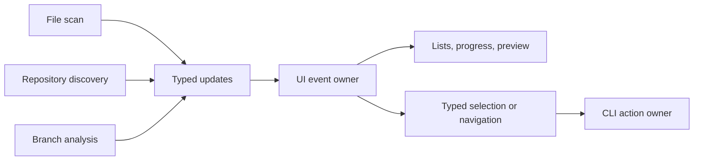

# Architectural simplification audit

Status: proposals only. No production refactor or dependency adoption was applied.
Source checkpoint: `c6a1d8b22d7f7bf8854b3931617a7dbf52957717`.
`python3 metrics/src/architecture_audit.py` checks the current production hashes
against the checkpoint and generates [the evidence](../../metrics/data/architecture-audit.json).

## Finding and recommendation

The TUI's file/shell protocol is an architectural lead, but its complete replacement
would be a rewrite with small estimated savings and no demonstrated user or performance
benefit. The current evidence does not justify it. The proposal below is retained as
due diligence and a rejected candidate, not a recommendation to build it.

The target is cumulative additional savings across many useful simplifications, not
a single large refactor. The inspected candidates do not yet establish that total.
Git traversal and filesystem inspection contain required policy and safety work,
and their full replacement estimates leave little demonstrated line savings.

Recommendation: do not replace the TUI on current evidence. Use the small stdlib candidates in
[type-4-similarities.md](type-4-similarities.md) for localized simplification.
Do not remove recovery, fresh validation, or the history command to meet a deletion quota.

## Measured boundaries and estimated replacements

| Candidate | Measured gross declaration lines | Estimated replacement lines | Estimated net lines removed | Assessment |
| --- | ---: | ---: | ---: | --- |
| Typed UI owner [U] | 463 | 290–460 | 3–173 | Rewrite rejected; no demonstrated benefit justifies its cost. |
| Native Git traversal [G] | 274 | 230–290 | −16–44 | Could use more code and more subprocess time. |
| Shared fresh inspection [I] | 127 | 110–170 | −43–17 | Possible traversal benefit; not a large deletion opportunity. |

Metric provenance:

- [U] 463 gross, 290–460 estimated replacement, 3–173 estimated net
  (metrics/data/architecture-audit.json#plans.typed_ui, python3 metrics/src/architecture_audit.py).
- [G] 274 gross, 230–290 estimated replacement, −16–44 estimated net
  (metrics/data/architecture-audit.json#plans.native_git, python3 metrics/src/architecture_audit.py).
- [I] 127 gross, 110–170 estimated replacement, −43–17 estimated net
  (metrics/data/architecture-audit.json#plans.single_inspection, python3 metrics/src/architecture_audit.py).

Gross counts are inclusive physical AST declaration spans, including internal blank
and comment lines; tests, docs, imports outside those declarations, and dependency
source are excluded. Estimates are hand-sized component budgets stored in the metric
script, not generated proof of removable code. Replacement budgets include retained
responsibilities inside the replaced symbols and caller integration. Negative net
values mean code growth. Overlapping or alternative proposals must not be summed.

The localized stdlib drafts save 9 lines in their measured research form
(metrics/data/architecture-audit.json#stdlib_draft_totals, python3 metrics/src/architecture_audit.py).
Combining those with the disjoint Git and inspection budgets yields −50 to 70 estimated
net lines removed (metrics/data/architecture-audit.json#cumulative_type4_plan,
python3 metrics/src/architecture_audit.py). This is planning arithmetic, not a validated
cleanup patch; it excludes the rejected UI rewrite and unpriced leads. The full
per-lead estimates and limits are in [type-4-similarities.md](type-4-similarities.md).

## Rejected candidate: typed UI owner

### Current ownership problem

[RunLive](../../internal/ui/live.go) owns the fzf process and producer lifetime,
then publishes rows, footer, and action files through temporary-file renames.
fzf shell bindings poll and reload that representation.
[ChooseFilesLive](../../internal/ui/live.go),
[ChooseLive and ChooseProjectLive](../../internal/worktree/live.go), and
[RunRepoUI](../../internal/repo/ui.go) separately encode domain data and decode selections.
Branch previews add another temporary-file protocol.

This is not proof that synchronization can be deleted. Producer completion, publication,
and process exit protect different lifetimes. The architectural opportunity is to give
the screen lifecycle and selection one owner so the serialization protocol is unnecessary.
That possible ownership change has not been shown to improve behavior, speed, or total
maintained complexity; the full rewrite and dependency costs outweigh the current
evidence for pursuing it.

### Behavior and state

The screen opens before discovery starts. Updates fill the active Files or Repos list
and loading indicator as results arrive. Enter on a duplicate group starts branch
analysis and then displays branch names, distinct recent commits, checkout aliases,
and cleanup evidence. The configured recent-work window, canonical base-repository
preference, and main-branch ranking stay in the existing domain analysis.

The UI owns active view, cursor/search/selection state, visible data, progress, and
the current producer lifetime. Selection refers to a domain identity, not a displayed
row number. One visible data snapshot is authoritative for rendering and selection;
formatted rows and counts are derived. A scan completion message must not overwrite
the selected project or a later scan. Cancel and join the old producer before accepting
its replacement, or use an explicit generation identity if concurrent producers are
required; do not introduce both mechanisms without a demonstrated need.

Preserve all duplicate groups for review and only mark safely retained copies as cleanup
candidates. Repos remains read-only. Files selection still passes through existing
confirmation, eligibility, and fresh execution checks. JSON and text output remain
usable without a terminal. Terminal controls in paths, errors, refs, and commit subjects
remain sanitized.

### Dependency due diligence

Bubble Tea's `Model.Update`, `Program.Send`, and `WithContext` fit typed producer
updates and terminal ownership. Bubbles supplies list filtering and viewport behavior.
Files/history multi-select and application navigation still require local policy.
`Send` can block before program startup, so producer startup order remains part of
the contract. Cancellation must reach the scanner and Git subprocesses and the producer
must finish before the command returns.

tview can provide tables, previews, and update dispatch, but fuzzy matching and
multi-select still need application glue or another library. Its inspected
`QueueUpdateDraw` is synchronous, so shutdown requires explicit lifetime handling.
The local module versions inspected establish API feasibility only. Choosing supported
versions, checking transitive dependencies and licenses, terminal behavior, build size,
startup cost, and search compatibility remain implementation work. No dependency has
been added. Moving work into a dependency is transferred ownership, not removal of its
implementation complexity.

### Production scope

The component ranges below are planning inputs from
`metrics/data/architecture-audit.json#plans.typed_ui.replacement_components`, generated
by `python3 metrics/src/architecture_audit.py`; their complete replacement total is [U].

| File / Symbol | Owner | New State / Mutable Fields | Est. production LoC |
| --- | --- | --- | ---: |
| `internal/ui`: event owner replacing `RunLive` | unslop | Active view, visible snapshots, current producer context | 65–100 |
| `internal/ui`: selection/search/navigation | unslop using Bubble Tea/Bubbles | Cursor, query, selected domain identities | 90–140 |
| Files/Repos/project view rendering | unslop | Derived display data; no persistent second index | 100–160 |
| `cmd/unslop` integration and history text fallback | unslop | Command-scoped inputs/results | 35–60 |

The exact removed-symbol inventory is stored under [U]. Keep `Groups`,
`canonicalRepository`, `betterBranch`, analysis, formatting helpers, and execution
policy unless a separate equivalence check justifies changing them. Do not build a
generic view registry, navigation framework, or new persistent cache.

### Hidden work and standalone value

The complete delivery includes the new terminal lifecycle, producer cancellation,
search and multi-select parity, typed selection identities, preview scrolling, screen
resize, tab/back/quit handling, noninteractive output, CLI wiring, and replacement of
fzf-specific test fixtures. Measure time to first screen, update responsiveness, search
latency, and cancellation using the same inputs as the current implementation.

A completed replacement independently removes the shell/file protocol while preserving
the CLI. A generic event loop or single-screen demo leaves both systems alive and has
no standalone cleanup value; it creates migration debt. If implemented, migrate the
complete selector boundary and remove the old transport rather than leaving a permanent
compatibility layer. Test/doc/dependency work is excluded from production-line budgets;
its duration has not been estimated here.

### Threat and verification

- Wrong item selected after a live update: test changing order and additions during
  search/multi-select, then verify selection resolves to the original domain identity.
- Stale result appears after tab/back navigation: exercise cancellation while discovery
  and branch analysis publish; reject old updates and join producers without deadlock.
- UI change weakens cleanup eligibility: retain tests for Files filtering and all fresh
  executor safeguards; keep repository screens read-only.
- Terminal or subprocess lifetime leaks: exercise quit during loading, errors, resize,
  and headless invocation with real terminal fixtures and the race detector.
- Replacement hides branch work or changes grouping: compare project JSON/text output
  and UI previews on merged, divergent, detached, shallow, dirty, and changed-ref fixtures.

## Alternatives checked

**Native Git.** Replace the application DAG with native ancestry and recent-history
queries, retaining object pooling, canonical selection, ranking, and all revalidation.
This moves traversal into its existing owner, but pairwise ancestry checks can multiply
subprocesses as branch-head count grows. The current graph permits in-process repeated
queries after a shared history read. Benchmark both on large duplicate groups before
claiming a performance-neutral simplification. The source-based replacement budget [G]
does not justify this change for line savings alone.

**One fresh subtree inspection.** Return protection, metadata, size/activity, and boundary
evidence from a shared traversal immediately before execution. Keep discovery as a
separate observation. The boundary owner must be below scanner/executor in the import
graph, because scanner already imports platform. This needs explicit early-exit/error
policy and OS device/reparse handling. The complete budget [I] is small or negative;
implement only for a measured traversal benefit or a reproduced invariant failure.

**Recovery or history-command deletion.** Removing the journal/trash transaction or
the separate history-bloat command would remove supported behavior. `RemoveAll`, a
trash dependency, or `git-filter-repo --analyze` has not been shown to preserve those
contracts. They are not justified architecture reductions.

## Did Giga have the signals?

| Question | Existing signal | Sufficiency and missing evidence |
| --- | --- | --- |
| Where should the audit start? | Espalier call/state edges and pressure; Decomplex inlined complexity and state heatmap | Partial: points to `AnalyzeProject`, live UI callbacks, and command orchestration. |
| Is there internal semantic overlap? | Dataflow clones, call-sequence clones, aliases, writer overlap | Partial: matched statements require contract checks; no general behavioral equivalence proof. |
| Is a maintained collection redundant? | Index fan-out, state reads/writes and implicit protocols | Partial: `heads`, `printed`, and `Project.Branches` serve different purposes; low-confidence grouping is not deletion proof. |
| Is this a file/shell protocol that a UI dependency can own? | Calls to temp-file, process, and string APIs | Partial: no complete resource identity/protocol view was found in the recorded artifact; request FR-RP. |
| Can a native/library function preserve the existing contract? | External/stdlib summaries and normalized facts | Partial: versioned replacement obligations and counterexamples are missing; request FR-RC. |
| Can the ranking be trusted as complete? | Corpus and language capability fields | Partial: selected-file completeness is distinct from resolved effects and runtime evidence; request FR-EH. |
| Does candidate size equal net savings? | Existing attributable-line tally | Insufficient: replacement/adapters and overlapping spans need explicit budgets; request FR-RB. |

The recorded Go corpus has 2,052 unresolved call orders
(metrics/data/architecture-audit.json#giga.corpus.call_orders_unresolved,
python3 metrics/src/architecture_audit.py). Go static evidence and a SCIP index are
present, while the language capability fields report no runtime tracing or type-indexing
support. Those fields describe different capabilities; a corpus marked complete does
not establish full semantic resolution.

Espalier records zero local complexity for some sizeable functions while Decomplex
reports substantial complexity for `AnalyzeProject`; do not treat different metric
producers as interchangeable. The inspected `pressure_rows` also emits a placeholder
operational component, not measured process/filesystem overhead. Missing metrics must
be distinguishable from measured zero. The requests and bounded implementation effort
are in [giga-feature-request.md](giga-feature-request.md).

## Why Not Simpler?

- **Delete / omit:** Live discovery, selection, branch review, and safe cleanup are requested behavior, so deleting screens or safety checks is not a complete replacement.
- **Reuse codebase:** `RunLive` already shares process control, but more wrappers would retain the file/shell protocol that creates the ownership problem.
- **Standard library:** Go's standard library supplies processes and channels but not a complete terminal selector with search, multi-select, and previews.
- **Native OS / platform:** fzf supplies selection, but the current live adapters still require application-owned transport and shell actions.
- **Existing dependencies / declarative formats:** unslop has no Go dependencies, and adopting a TUI library still requires the domain bindings and lifetime checks sized above.
- **Minimal custom code:** A typed event owner plus direct domain views is the smallest proposed replacement boundary, and it must beat the complete current implementation before adoption.

## Public API changes if implemented

| Surface | Proposed change and side effects | Consumer alignment |
| --- | --- | --- |
| CLI flags, JSON and text contracts | Preserve supported inputs/output; terminal dependency changes only after compatibility checks. | Existing command tests and headless fixtures. |
| `ui.RunLive(cmd *exec.Cmd, produce func(context.Context, func(LiveUpdate))) ([]byte, error)` | Remove byte/process transport; route producer updates to the typed UI owner. | Files and repository producers; cancellation/startup/exit tests. |
| `ui.ChooseFilesLive` | Keep `([]scanner.Candidate, bool, error)` result semantics during migration; remove the fzf binary parameter after all callers switch. | `runFiles`, eligibility and navigation fixtures. |
| `worktree.ChooseLive` | Keep `([]Worktree, bool, Report, error)` selection/navigation/error meaning during migration. | `runWorktreesSubcommand` and duplicate-group fixtures. |
| `worktree.ChooseProjectLive` | Keep `(Project, bool, bool, error)` meaning; preview data stays typed instead of written to files. | Branch-detail and back/Files/quit fixtures. |
| `repo.RunRepoUI` | Preserve manifest selection and text fallback; route interactive selection through the same terminal owner. | History CLI and manifest tests. |
| Rows/token helpers in the measured boundary | Delete after every terminal caller uses domain identities; retain pure formatting and grouping policy. | No long-lived second adapter system. |

These are migration boundaries, not approval of a frozen generic UI API. Exact event
types must follow actual callers; no new public service or persistent store is proposed.
